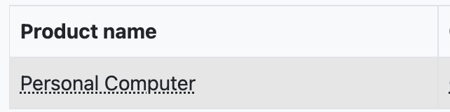
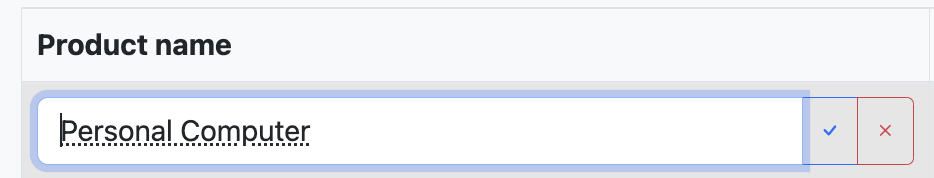
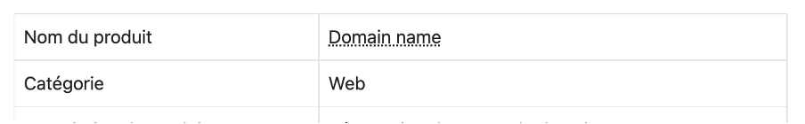
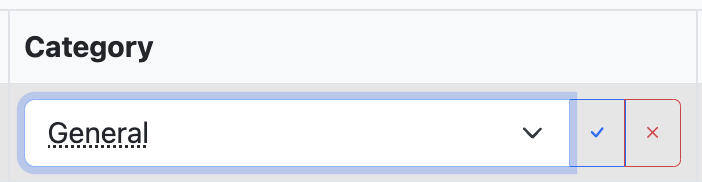
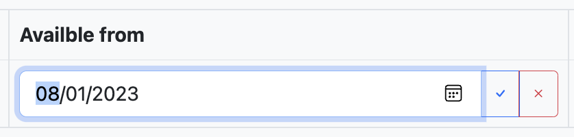
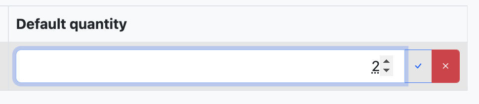

# inline-edit
> Inline field editor for Django apps

Who has never dreamed about a simple inline edit mechanism? I know that they are many libraries or scripts available, but I found them not too easy to understand or with too many parameters to be able to quickly and easily use them. So, I decided to write my own library and let me here share the result with you.

The implementation that will be here describe is based on Javascript and use some Jquery feature. The back end to update effectiverly the database is based on the Django framework, but it can easily but translated to an other framework, like Flask, or any other language like PHP.

The javascript file (*inline_edit.js*) and the css stylesheet file (*inline_edit.css*) can be found into the driectory *static/inline_edit*. 

## How does it work?

First of all, you have to add a reference to the stylesheet *inline_edit.css* and to the javascript file *inline_edit.js* into you HTML file.

    <link href="/static/inline_edit/inline_edit.css" rel="stylesheet" type="text/css">

and

    

Copy the directory *static/inline_edit* and its content into your Django *static* directory

Add the directory *lib* in the root of your Django application

Add an entry into your *urls.py* file in order to call the function to update your database

    path("update/data/", upd_data, name="update_data" ),

Then modify you html code according to the description here after (add `` attribute arround the item you want to edit).

    
        {{ object.name }}
    

Restart your application, double click on item... and that's it! Enjoy

## Step by step modification

### Modification in your html file
To implement the inline edit you have to add a few attrivutes around the element that you want to edit. For example, you want to edit the name of a product. Then around the name of the product you will add some html tags

    <table class="table table-hover table-bordered">
        <tr>
            <td></td>
            <td>{{ object.name }}</td>
        </tr>
        <tr>
            <td></td>
            <td>{{ object.category }}</td>
        </tr>
    </table>

In django template's, `{{ object.name }}` will be effectively replace by the name of the product.  
The same for `{{ object.category }}` which will display the name of the category of the product.

The above code will product something like this :

To enable inline edit we must change the html code to:

    <td>
        
            {{ object.name }}
        
    </td>

If we refresh the page, it will now looks to something like this :

You do not see many changes, except the dotted line under the name of the product. This shows you that you can edit this information by double clicking on it.

Of course, you can easily change this layout formatting by modifying the css file *inline_edit.css*.

Now if we double click on the product name, an input field will replace the text, allowing to update the information

Change the information to, i.e., it’s English translation

To validate the change just click outside the field and that’s it!

The **inline edit** now works with *text*, *number*, *checkbox*, *select* and *date* field.

Now that you have seen how easy it is easy to implement the inline edit, let’s come back to the parameter

    <td>
        
            {{ object.name }}
        
    </td>

The class name must be `class="inline-edit"  of course you can add any other class definition to it.

`data-id` is the id of the record to which belong the field “object.name”
`data-name="bills.Product.name"  describe which field of the database must be updated.  
The name is composed of the *app_name*, the *model_name* and the *field_name*.

So in the exemple `data-name="bills.Product.name"` the django *app_name* is **bills**.  
In this Django app, in the file **models.py** there is a model called *“Product”* (`class Product(models.Model):`) with a field called *name* (`name = models.CharField(max_length=255)`)

    class Product(models.Model):
        # Relationships
        category = models.ForeignKey(ProductCategory, on_delete=models.CASCADE, related_name='products', default=1)
        # Fields
        name = models.CharField(max_length=255)

`data-type="text"` define that the input field is of type *text*.  
The allowed values are *text*, *number*, *select*, *date* or *checkbox*.

`data-value="{{ object.name }}"` is a raw copy the value before it is edited.  
I added this, because sometimes you add other information like a currency symbol or format the value to be more user friendly.

## What about editing a foreign key? 

It works pretty much the same way, excepted that the type of input field will be *“select”* and that we need to get the list of value for this *Select* field. This will be done by adding an extra attribute `data-url`. The result is :

    <tr>
        <td></td>
        <td>
            
                {{ object.category }}
            
        </td>
    </tr>

The attribute `data-url` will contain the url to retrieve the list of categories in json format.  
The information returned must contains and *id* and *name* field.  
Example or return values :

    [{"id":7,"name":"Web"},{"id":8,"name":"Licences"},{"id":9,"name":"Devolo"},{"id":10,"name":"SSD"},{"id":11,"name":"Hardware"},{"id":1,"name":"Général"}]

You can easily use the Django *rest_framework* to carry on this.

Here is an example of the API view to return the list of ProductCategory (To have a very good documentation on Django Rest Framework [click here](https://simpleisbetterthancomplex.com/tutorial/2018/11/22/how-to-implement-token-authentication-using-django-rest-framework.html))
(file is : *app_name/views_api.py*)

    from rest_framework import generics, permissions
    from rest_framework.decorators import api_view
    from rest_framework.response import Response
    from rest_framework.reverse import reverse
    from .serializers import *
    from .permissions import IsOwnerOrReadOnly
    
    class ProductCategoryList(generics.ListCreateAPIView):
        queryset = ProductCategory.objects.all()
        serializer_class = ProductCategorySerializer
        permission_classes = (permissions.IsAuthenticated,)

The code for the serializer is (file : *app_name/serializers.py*):

    from rest_framework import serializers
    from .models import *
    
    
    class ProductCategorySerializer(serializers.ModelSerializer):
    
        class Meta:
            model = ProductCategory
            fields = ('id', 'name') :

Add in your *urls.py* the following line 

    path('product/unit/api', views_api.ProductUnitList.as_view(), name='api-product-unit-list'),

Of course you have to create as many API function as you need to rerieve list of values for any *select* input item

When you double click on the information to change, an input field with the actual value is shown

 

Click again into the field, the list of options is shown.
 

Select the wanted value

 
And click outside of the field.
The value is changed

 

Let’s have a look for a **Boolean** value, like if the product is available in the webshop. In the HTML we had:

    <tr>
        <td></td>
        <td>
            {{ object.webshop|YesNo }}
        </td>
    </tr>

Let’s add the attributes to enable the inline edit. The code is now:

    <tr>
        <td></td>
        <td>
            
            {{ object.webshop|YesNo }}
            
        </td>
    </tr>

The output is:
 

For a date the HTML attributes will be:

    <tr>
        <td></td>
        <td>
            
                {{ object.available_from|default_if_none:""|date:"d/m/Y" }}
            
        </td>
    </tr>

 

You can of course select the date with the drop-down calendar

To close and save the modification, click outside of the input field.

For a **number**:

    <tr>
        <td></td>
        <td>
            
                {{ object.default_quantity }}
            
        </td>
    </tr>

Double click on the value to open the inline edit
 

Update the value and click outside to validate the change
 

## The back end script

The back end script is written in python, based on the Django framework.  
You can find the source in the file *utils.py* into the directory *lib/*.

The function `def upd_data(request):` is the code responsible to update the value of the specified field into your database.

You can find the code in the file *lib/utils.py*

Do not forget to add in the *urls.py* a reference to the function :

    path("update/data/", upd_data, name="update_data" ),

## Contributing

Inline Edit is an open source program. Feel free to fork and contribute.

In order to keep the match between this documentation and the last release, please contribute and pull requests on the dedicated `develop` branch.

## License

**Inline Edit - inline Editor**  
**Copyright (c) 2023 Pierre Delporte**  
[pierre.delporte@alf-solution.be](mailto:pierre.delporte@alf-solution.be)  
[https://www.alf-solution.be](https://www.alf-solution.br)  

MIT License

Copyright (c) [year] [fullname]

Permission is hereby granted, free of charge, to any person obtaining a copy
of this software and associated documentation files (the "Software"), to deal
in the Software without restriction, including without limitation the rights
to use, copy, modify, merge, publish, distribute, sublicense, and/or sell
copies of the Software, and to permit persons to whom the Software is
furnished to do so, subject to the following conditions:

The above copyright notice and this permission notice shall be included in all
copies or substantial portions of the Software.

THE SOFTWARE IS PROVIDED "AS IS", WITHOUT WARRANTY OF ANY KIND, EXPRESS OR
IMPLIED, INCLUDING BUT NOT LIMITED TO THE WARRANTIES OF MERCHANTABILITY,
FITNESS FOR A PARTICULAR PURPOSE AND NONINFRINGEMENT. IN NO EVENT SHALL THE
AUTHORS OR COPYRIGHT HOLDERS BE LIABLE FOR ANY CLAIM, DAMAGES OR OTHER
LIABILITY, WHETHER IN AN ACTION OF CONTRACT, TORT OR OTHERWISE, ARISING FROM,
OUT OF OR IN CONNECTION WITH THE SOFTWARE OR THE USE OR OTHER DEALINGS IN THE
SOFTWARE.
